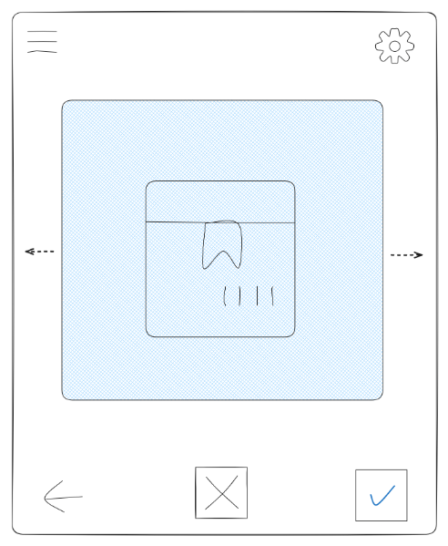

# HaustierTinder

Willkommen bei HaustierTinder, unserer Vermittlung für Haustiersuchende und Tierheime im Tinder-Format! :party:

## Entscheidungen
* Sprache: TypeScript 5.4
* Frontend: Vue 3, Bootstrap 5
* Datenbank: Localstorage
* Datenanalyse: JupyterNotebook

## Features
* Profil (Suchende): [Tim]
    - Präferenzen (registration (überprüfbar) + nachträglich) 
        -> Filter
    - "Matches" anzeigen
* Profil (Tierheim): [Vicky]
    - Tierinserate anlegen
    - Informationen -> Kontakt

* Administration: [Matthes, Danny]
    - Tierheimprofile anlegen

* Login [Danny, Matthes]
    - Enduser, Admin, Tierheime

* Default- / Start-Seite [Tobias, Fabian, Vincent]
    - swipen
    - buttons (match, ablehnen, zurück, history, Filter)
      -> history getrennt nach Matches / abgelehnt 
    - Filter
        * Art -> Unterart
        * Entfernung
        * Alter
    - Tutorial (erstes Öffnen)

✔ Repository-Management [Danny]
    - Dependency Management
    - PR Testing Workflows
    - QoL-Dateien (CODEOWNERS, nvmrc, etc.)

* Datenanalyse vorbereiten [Johannes]

* QoL, UI/UX, QA [Danny]
    - Endabnahme (= QA), insbesondere von UI/UX
    - kontinuierliche Betrachtung und Erwägung möglicher QoL-Features

### Datenbank:

### Datenstruktur

id: string

User[]

    name: string
    email: email
    password: string
    role: "user"| "admin"|"tierheim"
    id:id
    geseheneTiere:
        {
        ids:[Tierheim_id,Tier_id]
        anzahl:number
        liked:boolean
        }[]

Tierheim[]

    name: string
    standort: string
    id:id
    telefonnummer:string
    email:email
    homepage: string
    tier[]
        name: string
        id: id
        alter: number
        art:string
        rasse:string
        farbe: string
        besonderheiten: string
